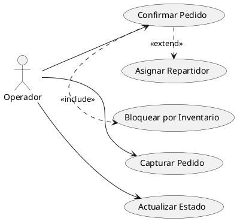
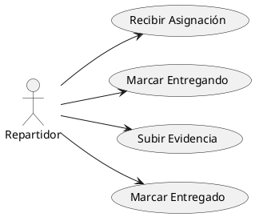
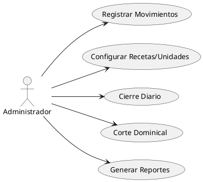

# Catálogo Detallado de Casos de Uso — Ecosistema Pizzería (Flutter + Firebase)

> Documento que **profundiza** en los casos de uso de las tres aplicaciones: **Controladora de Pedidos**, **Repartidor** y **Inventario/Contabilidad**. Cada caso incluye: objetivo, actores, disparadores, precondiciones, flujo principal, variaciones/alternativas, excepciones, postcondiciones, datos/validaciones, reglas de negocio, seguridad, métricas y criterios de aceptación (Gherkin).

---

## 0. Mapa de Roles y Responsabilidades
- **Administrador**: inventario, configuración, reportes, cortes.
- **Operador**: captura/confirmación de pedidos, asignación, comunicación, seguimiento.
- **Repartidor**: recepción, tránsito y confirmación de entrega.

---

# 1) Controladora de Pedidos (Operador)

## 1.1 Capturar Pedido
**Objetivo**: Registrar un pedido proveniente de WhatsApp, llamada o mostrador.

**Actores**: Operador (primario), Cliente (fuente de datos).

**Disparadores**: Llega solicitud por WhatsApp o cliente en mostrador/teléfono.

**Precondiciones**:
- El operador ha iniciado sesión y posee rol `operador` o `admin`.
- Catálogo de productos activo con precios y recetas configuradas.

**Flujo principal**:
1. Operador abre `CapturaPedidoPage`.
2. Selecciona cliente frecuente o crea uno nuevo.
3. Agrega productos/especialidades y cantidades.
4. Sistema calcula total y sugiere ETA (Remote Config).
5. Operador define tipo de pago y/o referencia.
6. Operador guarda el pedido en estado **Capturado**.

**Variaciones**:
- **V1**: Cliente frecuente: auto-relleno de datos; solo se valida cambios de dirección/teléfono.
- **V2**: Pedido al mostrador: `canal = app` y `ubicación = establecimiento`.

**Excepciones**:
- **E1**: Producto inactivo → no permite agregar.
- **E2**: Datos insuficientes (sin ubicación válida) → error y bloqueo.

**Postcondiciones**:
- Pedido persistido en `pedidos/{id}` con estado **Capturado**.

**Datos/Validaciones**:
- Precio ≥ 0; cantidad > 0; teléfono E.164 opcional; ubicación con `lat/lng` o texto.

**Reglas de negocio**:
- No se admite preparación si el inventario no cubre la receta.

**Seguridad**:
- Solo `operador/admin` pueden crear pedidos.

**Métricas**:
- Tiempo de captura; tasa de errores de validación.

**Aceptación (Gherkin)**:
```gherkin
Feature: Capturar Pedido
  Scenario: Captura exitosa
    Given soy Operador autenticado
    And el catálogo de productos está activo
    When agrego 2 Pizzas Pepperoni y selecciono cliente frecuente
    And guardo el pedido
    Then el pedido se registra en estado "capturado"
    And el total es calculado correctamente
```

---

## 1.2 Confirmar Pedido
**Objetivo**: Validar inventario y pasar pedido a **Preparación**, registrando consumo de insumos.

**Actores**: Operador.

**Disparadores**: Operador presiona "Confirmar" desde la cola.

**Precondiciones**:
- Pedido en **Capturado** con detalles completos.
- Inventario configurado con umbrales.

**Flujo principal**:
1. Sistema lee receta por producto y stock actual.
2. Valida que la receta cubre el stock.
3. Ejecuta transacción: cambia estado a **Preparación** + crea `movimientos_inventario` de tipo `consumo`.
4. Calcula ETA final y actualiza `hora_estimada_entrega`.

**Variaciones**:
- **V1**: Bloqueo por insumo crítico → el sistema impide confirmar (ver caso 1.5).

**Excepciones**:
- **E1**: Concurrencia alta → reintento de transacción.
- **E2**: Error de red → rollback y mensaje.

**Postcondiciones**:
- Pedido en **Preparación**; inventario descontado.

**Métricas**:
- Latencia de confirmación; tasa de bloqueos por inventario.

**Aceptación**:
```gherkin
Feature: Confirmar Pedido
  Scenario: Inventario suficiente
    Given un pedido capturado con una Pizza Pepperoni
    And el stock de queso y harina es suficiente
    When confirmo el pedido
    Then el estado cambia a "preparacion"
    And se registran movimientos de inventario por la receta
```

---

## 1.3 Asignar Repartidor
**Objetivo**: Asociar un repartidor disponible al pedido/entrega.

**Actores**: Operador.

**Disparadores**: Operador asigna manualmente o sistema sugiere.

**Precondiciones**:
- Pedido en **Preparación**; repartidores activos.

**Flujo principal**:
1. Operador elige repartidor desde la cola.
2. Sistema crea/actualiza `entregas/{id}` con `repartidor_id` y estado **asignado**.
3. Se envía notificación FCM al repartidor.

**Variaciones**:
- **V1**: Auto-asignación por proximidad.

**Excepciones**:
- **E1**: Token FCM inválido → reintentos; fallback a chat interno.

**Postcondiciones**:
- Entrega con repartidor asignado y notificado.

**Métricas**:
- Tiempo medio de asignación; tasa de notificaciones fallidas.

**Aceptación**:
```gherkin
Feature: Asignar Repartidor
  Scenario: Asignación manual
    Given hay repartidores activos
    And el pedido está en "preparacion"
    When asigno a Repartidor Juan
    Then se crea/actualiza la entrega con estado "asignado"
    And Juan recibe una notificación
```

---

## 1.4 Actualizar Estado Pedido (Preparación → Entregando → Entregado)
**Objetivo**: Reflejar cambios de estado y tiempos (salida/entrega).

**Actores**: Operador, Repartidor.

**Disparadores**: Repartidor retira/entrega; Operador corrige estados.

**Precondiciones**:
- Pedido confirmado y entrega creada.

**Flujo principal**:
1. Repartidor marca **Entregando** al retirar.
2. Repartidor marca **Entregado** al finalizar y sube evidencia.
3. Sistema registra `hora_salida`, `hora_llegada`, `tiempo_transito` y actualiza pedido.

**Variaciones**:
- **V1**: Corrección manual por Operador (pérdida de señal).

**Excepciones**:
- **E1**: Evidencia fallida → reintento, permitir entrega sin evidencia.

**Postcondiciones**:
- Pedido **Entregado**; métricas cerradas.

**Métricas**:
- Tiempos de preparación y tránsito; cumplimiento ETA.

**Aceptación**:
```gherkin
Feature: Actualizar Estado Pedido
  Scenario: Flujo normal de entrega
    Given el repartidor retira el pedido
    When marca "entregando"
    And al llegar marca "entregado" con evidencia
    Then se registran hora de salida y llegada
    And el pedido queda en estado "entregado"
```

---

## 1.5 Bloqueo por Inventario Crítico
**Objetivo**: Impedir confirmaciones cuando insumos clave están agotados.

**Actores**: Operador.

**Disparadores**: Validación previo a confirmar.

**Precondiciones**:
- Umbral de inventario bajo configurado.

**Flujo principal**:
1. Sistema compara stock vs receta y umbrales.
2. Si falta insumo, muestra alerta y bloquea confirmación.

**Variaciones**:
- **V1**: Override temporal (solo `admin`) con justificación.

**Excepciones**:
- **E1**: Stock desactualizado → solicitar refresco/ajuste.

**Postcondiciones**:
- Pedido sigue en **Capturado**.

**Aceptación**:
```gherkin
Feature: Bloqueo por inventario crítico
  Scenario: Insumo agotado
    Given el stock de pepperoni es 0
    When intento confirmar una Pizza Pepperoni
    Then el sistema bloquea la confirmación
    And muestra alerta de inventario
```

---

# 2) App Repartidor

## 2.1 Recibir Asignación
**Objetivo**: Notificar y abrir detalle de entrega.

**Actores**: Repartidor.

**Disparadores**: Push FCM con `accion=abrir_entrega`.

**Precondiciones**:
- Repartidor autenticado y con token FCM registrado.

**Flujo principal**:
1. Llega push → `go_router.go('/entregas/:id')`.
2. Carga datos de entrega y destino.

**Variaciones**:
- **V1**: Sin conexión → abre desde historial.

**Excepciones**:
- **E1**: ID entrega no existe → error y retorno a lista.

**Postcondiciones**:
- Entrega visible y lista para retiro.

**Aceptación**:
```gherkin
Feature: Recibir Asignación
  Scenario: Apertura por notificación
    Given estoy autenticado como repartidor
    When recibo un push con entrega_id
    Then la app abre el detalle de esa entrega
```

---

## 2.2 Marcar Entregando
**Objetivo**: Indicar salida a reparto.

**Actores**: Repartidor.

**Disparadores**: Botón "Entregando".

**Precondiciones**:
- Entrega en estado **asignado**.

**Flujo principal**:
1. Repartidor confirma retiro.
2. Sistema actualiza estado a **entregando** y `hora_salida`.

**Excepciones**:
- **E1**: Falta de permisos de ubicación → continuar sin tracking.

**Postcondiciones**:
- Entrega en tránsito; pedido en **Entregando**.

**Aceptación**:
```gherkin
Feature: Marcar Entregando
  Scenario: Salida a domicilio
    Given tengo una entrega asignada
    When confirmo retiro
    Then el estado cambia a "entregando"
    And se registra hora de salida
```

---

## 2.3 Subir Evidencias y Marcar Entregado
**Objetivo**: Completar la entrega con evidencia.

**Actores**: Repartidor.

**Disparadores**: Botón "Entregado" y carga de imagen.

**Precondiciones**:
- Entrega en **entregando**.

**Flujo principal**:
1. Repartidor toma foto y la sube a Storage.
2. Actualiza entrega a **entregado**, registra `hora_llegada` y `tiempo_transito`.
3. Sistema notifica a operador.

**Variaciones**:
- **V1**: Sin foto → permitir finalizar; registrar motivo.

**Excepciones**:
- **E1**: Error al subir imagen → reintento local.

**Postcondiciones**:
- Entrega cerrada; pedido **entregado**.

**Aceptación**:
```gherkin
Feature: Finalizar Entrega
  Scenario: Con evidencia
    Given la entrega está en "entregando"
    When subo la foto y marco "entregado"
    Then se registra hora de llegada y tiempo de tránsito
    And el operador recibe confirmación
```

---

# 3) Inventario y Contabilidad (App Escritorio)

## 3.1 Registrar Alta/Ajuste/Merma
**Objetivo**: Mantener stock real con movimientos.

**Actores**: Administrador.

**Disparadores**: Formulario de movimiento.

**Precondiciones**:
- Insumos definidos con unidades y umbrales.

**Flujo principal**:
1. Admin selecciona insumo y tipo de movimiento.
2. Ingresa cantidad y unidad.
3. Sistema crea `movimientos_inventario` y actualiza stock.

**Variaciones**:
- **V1**: Merma con causa; Ajuste con referencia.

**Excepciones**:
- **E1**: Unidad no válida → bloqueo.

**Postcondiciones**:
- Stock actualizado; bitácora registrada.

**Aceptación**:
```gherkin
Feature: Movimientos de Inventario
  Scenario: Ajuste de stock
    Given existe el insumo Queso Mozzarella
    When registro un ajuste de +2 kg
    Then el stock se incrementa en 2 kg
    And queda registrado el movimiento
```

---

## 3.2 Configurar Unidades/Recetas
**Objetivo**: Definir consumo por producto y unidades.

**Actores**: Administrador.

**Disparadores**: Pantalla de configuración inicial o edición.

**Precondiciones**:
- Catálogo de productos.

**Flujo principal**:
1. Admin edita receta del producto: lista de `RecetaItem`.
2. Define unidades por insumo (kg, pieza, litro).
3. Guarda configuración.

**Excepciones**:
- **E1**: Receta vacía → bloqueo.

**Postcondiciones**:
- Recetas/unidades actualizadas.

**Aceptación**:
```gherkin
Feature: Configuración de Recetas
  Scenario: Editar receta de Pizza Pepperoni
    Given el producto Pizza Pepperoni existe
    When agrego 0.3 kg de queso y 20 piezas de pepperoni por unidad
    Then la receta queda guardada
```

---

## 3.3 Cierre Diario
**Objetivo**: Consolidar ventas e inventario por día hábil.

**Actores**: Administrador (revisión), Sistema (ejecutor).

**Disparadores**: Scheduler a la hora de cierre (config).

**Precondiciones**:
- Horarios hábiles definidos.

**Flujo principal**:
1. Leer pedidos entregados del día.
2. Calcular totales y métricas.
3. Generar documento de cierre.

**Excepciones**:
- **E1**: Pedidos en tránsito al cierre → se excluyen o se marcan como pendientes.

**Postcondiciones**:
- Cierre almacenado y consultable.

**Aceptación**:
```gherkin
Feature: Cierre Diario
  Scenario: Cierre exitoso
    Given son las 23:00 y hay pedidos entregados
    When se ejecuta el cierre diario
    Then se genera el documento con totales de ventas
```

---

## 3.4 Corte Dominical (22:00)
**Objetivo**: Consolidación semanal de inventario y dinero.

**Actores**: Sistema (ejecutor), Administrador (revisión).

**Disparadores**: Scheduler dominical.

**Precondiciones**:
- Configuración de hora y política de corte.

**Flujo principal**:
1. Leer ventas/egresos/consumos de la semana.
2. Consolidar totales y generar `corte`.
3. Emitir alertas de inventario bajo.

**Postcondiciones**:
- Corte generado; KPIs semanales disponibles.

**Aceptación**:
```gherkin
Feature: Corte Dominical
  Scenario: Consolidación semanal
    Given es domingo 22:00
    When se ejecuta el corte
    Then se crea el documento de corte con ingresos y egresos
```

---

# 4) Transversales

## 4.1 Notificar Repartidor
**Objetivo**: Enviar push al tópico de repartidores.

**Actores**: Operador (solicitante), Sistema (emisor).

**Flujo principal**:
1. Construir payload `{accion, entrega_id}`.
2. Enviar vía FCM al tópico `/topics/repartidores`.
3. Registrar resultado y reintentos.

**Aceptación**:
```gherkin
Feature: Notificar Repartidor
  Scenario: Push a tópico
    Given hay una entrega asignada
    When solicito notificación
    Then se envía un push con accion "abrir_entrega" y el entrega_id
```

## 4.2 Alertar Demora
**Objetivo**: Informar cuando la preparación o entrega excede umbral.

**Actores**: Sistema, Operador.

**Flujo principal**:
1. Comparar tiempos reales vs umbrales Remote Config.
2. Marcar pedido/entrega con bandera de demora.
3. Generar notificación interna.

**Aceptación**:
```gherkin
Feature: Alertar Demora
  Scenario: Entrega tardía
    Given el tiempo de tránsito supera el umbral
    When se detecta la condición
    Then se marca el pedido como "demora" y se notifica al operador
```

---

## 5) Diagrama de Casos de Uso (PlantUML) — Controladora de Pedidos (incluye/extend)


## 6) Diagrama de Casos de Uso (PlantUML) — Repartidor


## 7) Diagrama de Casos de Uso (PlantUML) — Inventario/Contabilidad


---

**Notas finales:**
- Todos los casos de uso respetan roles y **reglas de seguridad** (Firestore/Storage/FCM + Custom Claims).
- Las **validaciones** (precio, cantidades, teléfono, ubicación) se aplican en front y se refuerzan en back.
- Las **métricas** y tiempos (preparación, tránsito, ETA) alimentan paneles de operación.

Si necesitas que transforme estos casos en **historias de usuario** con **criterios de aceptación** por sprint, te lo preparo.
