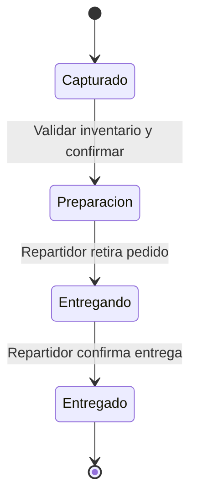
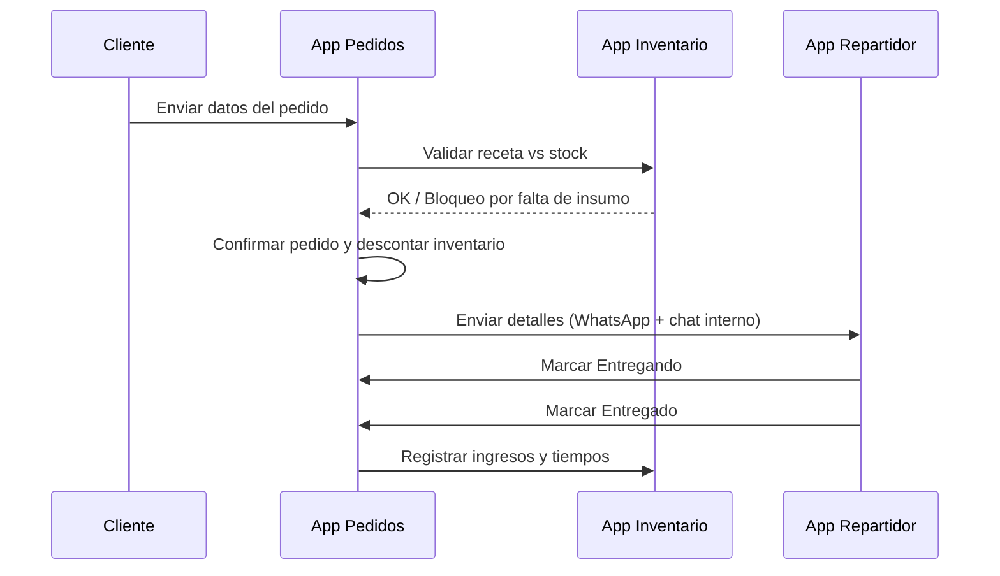
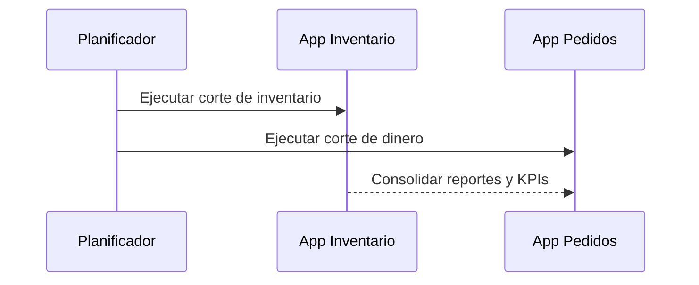

# Ecosistema de Aplicaciones para Administración de Pedidos, Reparto e Inventario (Negocio de Pizzas)

## 1. Resumen Ejecutivo
Sistema integral compuesto por **tres aplicaciones** orientadas a la operación diaria de una pizzería: control de inventario y contabilidad (escritorio), gestión y toma de pedidos (tablet/teléfono), y entregas (teléfono del repartidor). El objetivo es asegurar **trazabilidad completa** desde la recepción del pedido hasta su entrega, con **actualizaciones automáticas de inventario**, **cortes programados** y **alertas operativas**.

## 2. Objetivos del Sistema
- Mantener un **registro exacto** de la materia prima, con unidades configurables (pieza, kilo, litro, etc.).
- **Detectar agotamientos y bajos niveles** de inventario, bloqueando ventas de productos imposibles de preparar.
- Unificar **contabilidad**: ingresos, egresos, ventas por periodo y cortes automáticos.
- Optimizar la **logística de reparto** con tiempos medidos y alertas de demora.
- Centralizar la **comunicación** con repartidores por chat interno y mensajería externa (WhatsApp).

## 3. Componentes del Ecosistema

### 3.1 Aplicación de Escritorio (Inventario y Contabilidad)
**Funciones principales:**
- Registro de **materia prima**: altas, ajustes, mermas y devoluciones.
- Configuración de **unidades de medida** por insumo (p. ej., harina en kg, queso en kg, pepperoni en piezas).
- Definición de **recetas** por producto: cantidades de insumos consumidos por cada unidad vendida.
- **Alertas** de inventario: bajo nivel, producto agotado, insumo con exceso de tiempo en existencia.
- **Bloqueo preventivo** de ventas cuando un insumo crítico está agotado.
- **Cortes automáticos**: todos los domingos 22:00 hora local (inventario y dinero).
- **Cierre diario configurable**: días/horarios establecidos en instalación; recalcula ventas e inventario.
- Módulo **contable**: ingresos, egresos, flujo de caja, conciliaciones, reportes por periodo.
- Panel de **KPIs**: ventas por hora/día, ticket promedio, tasa de entregas a tiempo, insumos más usados.
- Gestión de **usuarios y roles**: administradores, encargados, analistas.

### 3.2 Aplicación Controladora de Pedidos (Tablet/Teléfono)
**Funciones principales:**
- Registro de pedidos provenientes de **WhatsApp** y **ingreso directo** (teléfono, mostrador, etc.).
- Validación/selección de **clientes frecuentes** y actualización de datos.
- Cálculo del **precio total**, tipo de pago, referencias y cambio (si aplica).
- **Actualización automática** de inventario según recetas al confirmar el pedido.
- **Sincronización** con contabilidad (ingresos) y con la app del repartidor.
- Gestión de estados del pedido: **Preparación → Entregando → Entregado**.
- Estimación y seguimiento de **tiempos de preparación y entrega**; alertas si se exceden.
- **Notificaciones** por agotamiento o bajo inventario; bloqueo de productos cuando aplique.
- Panel de **colas** de pedidos con prioridades y tiempos restantes.

### 3.3 Aplicación del Repartidor (Teléfono)
**Funciones principales:**
- Recepción de **detalles del pedido** (productos, total, nombre, número, ubicación).
- **Chat interno** con la controladora de pedidos.
- Confirmación de **retiro del pedido** (cambia a *Entregando*) y **entrega** (cambia a *Entregado*).
- Registro automático de **tiempos de entrega** y alertas de demora.
- Historial de **entregas** y métricas personales (tiempo medio, entregas por turno).

## 4. Flujo Operativo

### 4.1 Alta y Configuración Inicial
1. Administradores ingresan al **panel** de la app de escritorio.
2. Configuran **unidades de medida** y **recetas** (consumo de insumos por producto).
3. Definen **días y horarios hábiles** y **cierre diario**.
4. Se habilita el **corte automático** cada domingo 22:00.

### 4.2 Registro de Pedido
Campos requeridos:
- **Producto(s)**
- **Especialidad** (para pizzas u otros productos)
- **Precio**
- **Tipo de pago** (con referencia si aplica)
- **Cambio** (si aplica)
- **Nombre del cliente** (con opción de guardarlo)
- **Número del cliente** (opcional)
- **Ubicación**
- **Hora de recepción**
- **Hora estimada de entrega** (automática o personalizada)

**Canales de origen:**
- **WhatsApp**: se solicitan/validan datos; clientes frecuentes se seleccionan y se actualizan si cambiaron.
- **Ingreso directo en la aplicación**: pedidos por llamada, mostrador u otros; mismo proceso de captura/validación.

### 4.3 Estados del Pedido y Medición de Tiempos
- **Preparación**: inicia al confirmar el pedido; se mide tiempo de preparación.
- **Entregando**: el repartidor retira el pedido; se mide tiempo de tránsito.
- **Entregado**: el repartidor confirma entrega; se cierra el pedido y se almacenan métricas.

Se generan **alertas** cuando los tiempos exceden umbrales configurados (preparación, salida, llegada).

### 4.4 Actualización de Inventario y Contabilidad
- Al **confirmar** un pedido, se descuenta inventario según receta.
- Si algún insumo queda por debajo de **umbral** o se **agota**, se notifica y puede **bloquearse** el producto.
- Los **ingresos** se registran automáticamente; los **egresos** se administran desde la app de escritorio.
- En **cierre diario**, se recalculan ventas e inventario; en **corte dominical** (22:00), se consolidan inventario y dinero.

## 5. Notificaciones y Comunicación
- Notificaciones automáticas a la **controladora de pedidos** por:
  - Insumo **agotado** o en **nivel crítico**.
  - Pedido con **demora** en preparación o entrega.
  - **Entrega confirmada** por repartidor.
- Envío de **detalles del pedido** al repartidor por **WhatsApp** y **chat interno** de la aplicación.

## 6. Roles y Permisos
- **Administrador**: configuración global, unidades de medida, recetas, cortes, reportes, contabilidad.
- **Operador de pedidos**: captura de pedidos, gestión de estados, comunicación con repartidores.
- **Repartidor**: recibe pedidos, confirma retiro y entrega, comunicación y métricas personales.

## 7. Reglas de Negocio Clave
- Un pedido **no puede** entrar a preparación si la **receta** no puede cubrirse con inventario disponible.
- **Bloqueo** de productos cuando se detecta insumo crítico agotado.
- **Cierre diario** recalcula ventas e inventario; **corte dominical 22:00** consolida saldo e inventario.
- La **hora estimada de entrega** puede ser automática (según carga de trabajo y distancia) o personalizada.
- Todo cambio de **estado** genera **eventos** para auditoría y métricas.

## 8. Métricas y Reportes
- **Operación**: pedidos por franja horaria, tiempos de preparación/entrega, tasa de cumplimiento de tiempos.
- **Inventario**: consumo por insumo, proyección de agotamientos, productos bloqueados por falta de insumo.
- **Ventas**: total por día/semana/mes, ticket promedio, métodos de pago, devoluciones.
- **Reparto**: tiempos promedio por repartidor, número de entregas, distancias estimadas.

## 9. Auditoría y Registro
- **Bitácora** de eventos: creación de pedido, cambios de estado, confirmaciones de entrega, ajustes de inventario.
- **Historial de clientes**: pedidos, direcciones y preferencias.
- **Trazabilidad**: pedido enlazado a insumos consumidos, usuario que operó y repartidor asignado.

## 10. Configuración y Parametrización
- **Unidades de medida** por insumo.
- **Recetas** por producto (consumo de insumos).
- **Umbrales de alerta** (bajo inventario, tiempos máximos).
- **Horarios hábiles** y **cierre diario**.
- **Corte dominical** automático a las 22:00.
- **Política de bloqueo** de productos.
- **Plantillas de comunicación** (mensaje al repartidor por WhatsApp y chat interno).

## 11. Datos y Estructuras (Modelo Lógico)

### 11.1 Inventario
- **Insumo**: id, nombre, unidad, stock actual, stock mínimo, fecha de última compra, vida útil/fecha de caducidad.
- **Movimiento de inventario**: id, insumo, tipo (alta/ajuste/merma/consumo), cantidad, fecha, usuario, referencia.

### 11.2 Productos y Recetas
- **Producto**: id, nombre, categoría (pizza, bebida, postre), precio base, especialidades.
- **Receta**: producto, insumo, cantidad por unidad, notas.

### 11.3 Pedidos
- **Pedido**: id, canal (WhatsApp/app directa), estado (Preparación/Entregando/Entregado), hora recepción, hora estimada entrega, cliente, total, tipo de pago, referencia, cambio.
- **Detalle del pedido**: producto, especialidad, cantidad, precio.
- **Tiempos**: inicio preparación, salida a entrega, hora de entrega, tiempos medidos y alertas.

### 11.4 Clientes
- **Cliente**: id, nombre, número (opcional), direcciones/ubicaciones, preferencia de pago, notas.

### 11.5 Entregas
- **Entrega**: id pedido, repartidor, estado, ubicación destino, hora de salida, hora de llegada, tiempo de tránsito, confirmación.

### 11.6 Contabilidad
- **Ingreso**: id, pedido, monto, método, fecha, usuario.
- **Egreso**: id, concepto, monto, fecha, usuario.
- **Cortes**: tipo (diario/dominical 22:00), periodo, totales, observaciones.

## 12. Estados y Transiciones

## 13. Secuencias Clave

### 13.1 Pedido desde WhatsApp

### 13.2 Corte Dominical 22:00

## 14. Alertas y Umbrales
- **Inventario bajo**: al cruzar umbral definido por insumo (p. ej., <= stock mínimo).
- **Agotado**: bloquea productos relacionados; notifica a controladora de pedidos.
- **Demora en preparación**: supera tiempo máximo configurado.
- **Demora en entrega**: supera tiempo máximo configurado.
- **Producto con exceso de tiempo en existencia**: sugiere rotación/merma.

## 15. Seguridad y Acceso
- **Registro e inicio de sesión** para las tres aplicaciones.
- Asociación de **App de Pedidos** a la **App de Escritorio**; y **App de Repartidor** asociada a la **App de Pedidos**.
- **Roles** con permisos diferenciados y **auditoría** de acciones críticas.

## 16. Experiencia del Usuario (Resumen)
- **Administradores**: panel completo de inventario/contabilidad, configuraciones y reportes.
- **Operadores**: cola de pedidos, edición rápida de clientes, visualización de estados y tiempos.
- **Repartidores**: vista de ruta/entregas, confirmaciones en un toque, comunicación integrada.

## 17. Consideraciones Operativas
- Configuraciones **editables en cualquier momento** (horarios, umbrales, recetas, unidades).
- Manejo de **mermas** y ajustes para mantener inventario realista.
- Plantillas de **mensajería** claras y estructuradas para agilizar comunicación con repartidores.
- Soporte a **especialidades** y **productos no pizza**.

---
**Este documento consolida y estructura los requerimientos funcionales del ecosistema, listo para usarse como base de especificación.**
